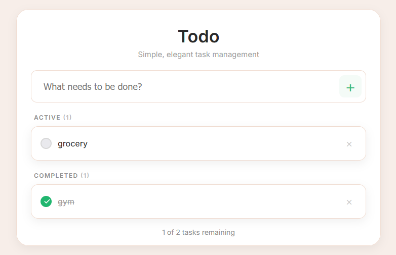

# TodoList

**TodoList** is a minimalistic, elegant task management application that helps you keep track of what needs to be done. It offers a clean, intuitive interface for creating, completing, and managing tasks with ease.

## Key Features

- **Simple, Elegant UI** – A minimalist design for distraction-free task management
- **Add Tasks Quickly** – Just type and press enter to create a new task
- **Task Status Management** – Mark tasks as active or completed with a single click
- **Live Counter** – Displays the number of remaining tasks
- **Responsive Design** – Works seamlessly on desktop and mobile devices 

